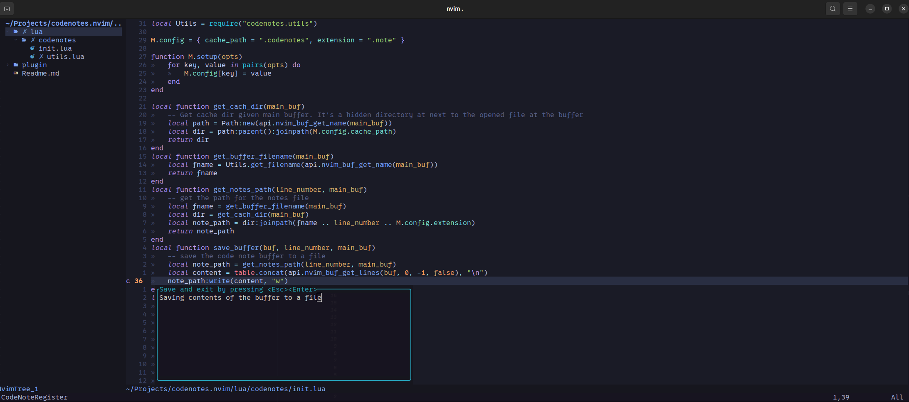

# CodeNotes: A Local Annotation Tool for Your Code

Enhance your coding experience with this easy-to-use plugin that allows you to add and manage annotations within your codebase without committing them.



## Key Features

- Effortlessly jot down and review any type of notes, similar to a code review process, within any file.
- Keep track of extensive annotations outside your source files for effective organization.

## Installation Guide

To get started, use your preferred Neovim package manager and install it. Here's an example using `lazy.vim`:

```lua
{
    "e3oroush/CodeNotes",
    opts={
        -- Default directory name to store your notes
        cache_path=".codenotes",
        -- Default file extension of the notes
        -- Add the directory or extension to your gitignore to keep them local
        extension=".note"
    }
}
```

## Operation Mechanism

It creates a hidden directory alongside your source file and manages annotations based on line numbers, offering a simple yet efficient solution!

You can use the following commands or create your own shortcuts:

- `CodeNoteRegister` To add a new note at the current location. It creates a `n` sign at the line location to show there's a note.
- `CodeNoteRead` To read the the note at the current location
- `CodeNoteDelete` To delete the note at the current location

## TODOs

- Implement markers to track code changes instead of just signs.
- Utilize `sqllite3db` for managing the history of notes.
- Develop a method to select and annotate parts of the code rather than just single lines.
- Add documentation
